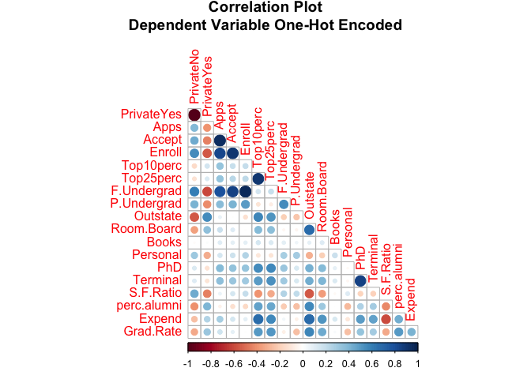
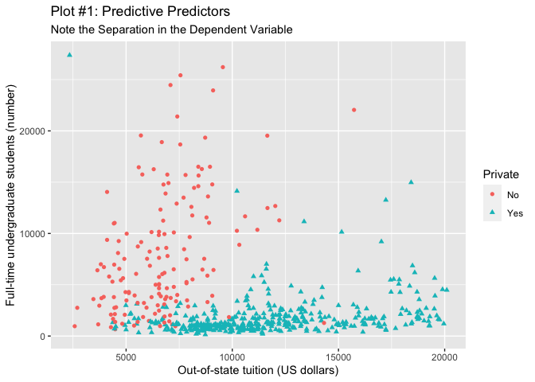
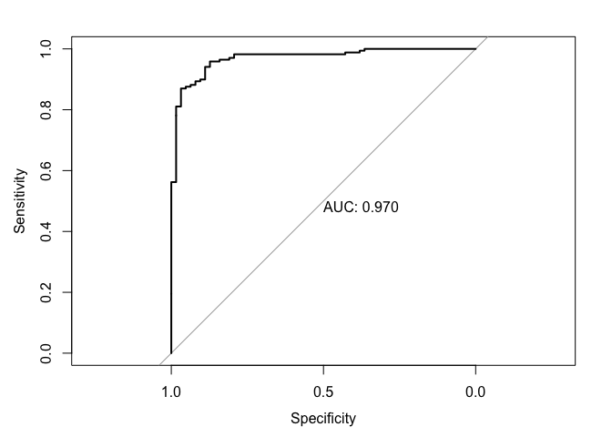
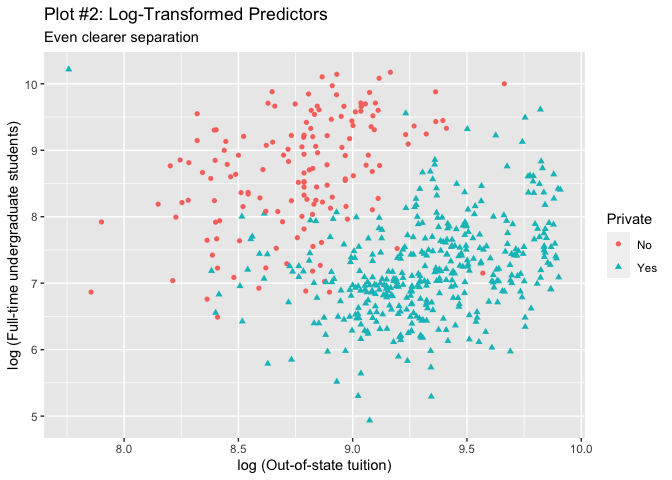

Module 3 - GLM and Logistic Regression
================
Justin Ehringhaus
October 09, 2022

``` r
# █▀█ █▀▀ █▀ █▀▀ ▀█▀ █▀
# █▀▄ ██▄ ▄█ ██▄ ░█░ ▄█
# clear console
cat("\014")
```



``` r
# clear global environment
rm(list = ls())
# clear plots
try(dev.off(dev.list()["RStudioGD"]), silent = TRUE)
# clear packages
try(p_unload(p_loaded(), character.only = TRUE), silent = TRUE)
# disables scientific notion for entire R session
options(scipen = 100)
# set seed for reproducibility
set.seed(44)

# █▀█ ▄▀█ █▀▀ █▄▀ ▄▀█ █▀▀ █▀▀ █▀
# █▀▀ █▀█ █▄▄ █░█ █▀█ █▄█ ██▄ ▄█
library(pacman)      # package manager
p_load(tidyverse)    # for ggplot and various other useful packages
p_load(ISLR)         # for the College dataset
p_load(caret)        # for making train/test partitions
p_load(skimr)        # for descriptive statistics, alternative to summary()
p_load(corrplot)     # for creating correlation matrix
p_load(glue)         # for pasting strings together with R code
p_load(janitor)      # for tabyl, alternative to table()
p_load(pscl)         # to calculate pseudo r-squared values
p_load(pROC)         # to visualize ROC curve
p_load(equatiomatic) # extract equation from model


# █░█ █▀▀ █░░ █▀█ █▀▀ █▀█ █▀
# █▀█ ██▄ █▄▄ █▀▀ ██▄ █▀▄ ▄█
# Outputs a string, prettified for printing to the console
pretty_glue <- function(string) {
  border <- strrep('*', 80)
  glue("{border}\n{toString(string)}\n{border}")
}

# Outputs a list containing the modified data and confusion matrix
glm.model.results <- function(data, dep.variable, model, cutoff) {
  data$probs <- predict(model, newdata = data, type = 'response')
  data$preds <- as.factor(ifelse(data$probs >= cutoff, 'Yes', 'No'))
  confusion.matrix <- confusionMatrix(data = data$preds, 
                                      reference = dep.variable, 
                                      positive = 'Yes')
  return(list('confusion.matrix' = confusion.matrix, 'data' = data))
}

# █ █▄░█ ▀█▀ █▀█ █▀█ █▀▄ █░█ █▀▀ ▀█▀ █ █▀█ █▄░█
# █ █░▀█ ░█░ █▀▄ █▄█ █▄▀ █▄█ █▄▄ ░█░ █ █▄█ █░▀█
pretty_glue("Using the College dataset from the ISLR library to build a logistic 
regression model to predict whether a university is private or public.")
```

    ## ********************************************************************************
    ## Using the College dataset from the ISLR library to build a logistic 
    ## regression model to predict whether a university is private or public.
    ## ********************************************************************************

``` r
# █░░ █▀█ ▄▀█ █▀▄   █▀▄ ▄▀█ ▀█▀ ▄▀█
# █▄▄ █▄█ █▀█ █▄▀   █▄▀ █▀█ ░█░ █▀█
college.data <- as_tibble(ISLR::College)
glimpse(college.data)
```

    ## Rows: 777
    ## Columns: 18
    ## $ Private     <fct> Yes, Yes, Yes, Yes, Yes, Yes, Yes, Yes, Yes, Yes, Yes, Yes…
    ## $ Apps        <dbl> 1660, 2186, 1428, 417, 193, 587, 353, 1899, 1038, 582, 173…
    ## $ Accept      <dbl> 1232, 1924, 1097, 349, 146, 479, 340, 1720, 839, 498, 1425…
    ## $ Enroll      <dbl> 721, 512, 336, 137, 55, 158, 103, 489, 227, 172, 472, 484,…
    ## $ Top10perc   <dbl> 23, 16, 22, 60, 16, 38, 17, 37, 30, 21, 37, 44, 38, 44, 23…
    ## $ Top25perc   <dbl> 52, 29, 50, 89, 44, 62, 45, 68, 63, 44, 75, 77, 64, 73, 46…
    ## $ F.Undergrad <dbl> 2885, 2683, 1036, 510, 249, 678, 416, 1594, 973, 799, 1830…
    ## $ P.Undergrad <dbl> 537, 1227, 99, 63, 869, 41, 230, 32, 306, 78, 110, 44, 638…
    ## $ Outstate    <dbl> 7440, 12280, 11250, 12960, 7560, 13500, 13290, 13868, 1559…
    ## $ Room.Board  <dbl> 3300, 6450, 3750, 5450, 4120, 3335, 5720, 4826, 4400, 3380…
    ## $ Books       <dbl> 450, 750, 400, 450, 800, 500, 500, 450, 300, 660, 500, 400…
    ## $ Personal    <dbl> 2200, 1500, 1165, 875, 1500, 675, 1500, 850, 500, 1800, 60…
    ## $ PhD         <dbl> 70, 29, 53, 92, 76, 67, 90, 89, 79, 40, 82, 73, 60, 79, 36…
    ## $ Terminal    <dbl> 78, 30, 66, 97, 72, 73, 93, 100, 84, 41, 88, 91, 84, 87, 6…
    ## $ S.F.Ratio   <dbl> 18.1, 12.2, 12.9, 7.7, 11.9, 9.4, 11.5, 13.7, 11.3, 11.5, …
    ## $ perc.alumni <dbl> 12, 16, 30, 37, 2, 11, 26, 37, 23, 15, 31, 41, 21, 32, 26,…
    ## $ Expend      <dbl> 7041, 10527, 8735, 19016, 10922, 9727, 8861, 11487, 11644,…
    ## $ Grad.Rate   <dbl> 60, 56, 54, 59, 15, 55, 63, 73, 80, 52, 73, 76, 74, 68, 55…

``` r
# ▀█▀ █▀█ ▄▀█ █ █▄░█   ░░▄▀   ▀█▀ █▀▀ █▀ ▀█▀
# ░█░ █▀▄ █▀█ █ █░▀█   ▄▀░░   ░█░ ██▄ ▄█ ░█░
pretty_glue("Creating a 70% / 30% split")
```

    ## ********************************************************************************
    ## Creating a 70% / 30% split
    ## ********************************************************************************

``` r
train.index <- 
  createDataPartition(y = college.data$Private, p = 0.70, list = FALSE)
college.train <- college.data[train.index, ]
college.test <- college.data[-train.index, ]
rm(train.index) # no longer needed
tabyl(college.train, Private)
```

    ##  Private   n   percent
    ##       No 149 0.2733945
    ##      Yes 396 0.7266055

``` r
tabyl(college.test, Private)
```

    ##  Private   n   percent
    ##       No  63 0.2715517
    ##      Yes 169 0.7284483

``` r
pretty_glue("The relative frequency distributions of the train and test set are 
almost equal. Also, note the class imbalance (72.66% Private and 27.34% Public).
The Accuracy Paradox may be something to look out for, which can occur when the 
model finds it expeditious to produce more accurate results simply by predicting
the larger class. Due to the class imbalance in this dataset, precision and
recall will serve as better metrics.")
```

    ## ********************************************************************************
    ## The relative frequency distributions of the train and test set are 
    ## almost equal. Also, note the class imbalance (72.66% Private and 27.34% Public).
    ## The Accuracy Paradox may be something to look out for, which can occur when the 
    ## model finds it expeditious to produce more accurate results simply by predicting
    ## the larger class. Due to the class imbalance in this dataset, precision and
    ## recall will serve as better metrics.
    ## ********************************************************************************

``` r
# █▀▀ ▀▄▀ █▀█ █░░ █▀█ █▀█ ▄▀█ ▀█▀ █▀█ █▀█ █▄█
# ██▄ █░█ █▀▀ █▄▄ █▄█ █▀▄ █▀█ ░█░ █▄█ █▀▄ ░█░
myskim <- skim_with(numeric = sfl(min, max))
myskim(college.train) %>% 
  select(-n_missing, -complete_rate, -starts_with('numeric.p'))
```

|                                                  |               |
|:-------------------------------------------------|:--------------|
| Name                                             | college.train |
| Number of rows                                   | 545           |
| Number of columns                                | 18            |
| \_\_\_\_\_\_\_\_\_\_\_\_\_\_\_\_\_\_\_\_\_\_\_   |               |
| Column type frequency:                           |               |
| factor                                           | 1             |
| numeric                                          | 17            |
| \_\_\_\_\_\_\_\_\_\_\_\_\_\_\_\_\_\_\_\_\_\_\_\_ |               |
| Group variables                                  | None          |

Data summary

**Variable type: factor**

| skim_variable | ordered | n_unique | top_counts        |
|:--------------|:--------|---------:|:------------------|
| Private       | FALSE   |        2 | Yes: 396, No: 149 |

**Variable type: numeric**

| skim_variable |     mean |      sd | hist  |    min |     max |
|:--------------|---------:|--------:|:------|-------:|--------:|
| Apps          |  2892.95 | 3922.72 | ▇▁▁▁▁ |   81.0 | 48094.0 |
| Accept        |  1950.19 | 2453.57 | ▇▁▁▁▁ |   72.0 | 26330.0 |
| Enroll        |   746.07 |  868.35 | ▇▁▁▁▁ |   35.0 |  5874.0 |
| Top10perc     |    27.88 |   18.05 | ▇▇▂▁▁ |    1.0 |    96.0 |
| Top25perc     |    55.90 |   19.76 | ▂▆▇▅▃ |    9.0 |   100.0 |
| F.Undergrad   |  3527.58 | 4529.36 | ▇▁▁▁▁ |  139.0 | 27378.0 |
| P.Undergrad   |   862.77 | 1593.81 | ▇▁▁▁▁ |    1.0 | 21836.0 |
| Outstate      | 10406.73 | 4021.99 | ▃▇▇▃▂ | 2340.0 | 20100.0 |
| Room.Board    |  4375.99 | 1111.79 | ▂▇▆▂▁ | 1780.0 |  8124.0 |
| Books         |   551.97 |  164.60 | ▃▇▁▁▁ |   96.0 |  2000.0 |
| Personal      |  1344.35 |  673.78 | ▇▃▁▁▁ |  300.0 |  6800.0 |
| PhD           |    72.54 |   16.24 | ▁▁▅▇▆ |   10.0 |   100.0 |
| Terminal      |    79.28 |   15.01 | ▁▁▃▆▇ |   24.0 |   100.0 |
| S.F.Ratio     |    14.24 |    4.11 | ▂▇▂▁▁ |    2.9 |    39.8 |
| perc.alumni   |    22.97 |   12.64 | ▅▇▆▂▁ |    0.0 |    64.0 |
| Expend        |  9619.07 | 5273.59 | ▇▁▁▁▁ | 3365.0 | 56233.0 |
| Grad.Rate     |    65.45 |   17.22 | ▁▆▇▅▁ |   15.0 |   118.0 |

``` r
pretty_glue("One-hot encoding converts the dependent variable `Private` into
numeric variables (`PrivateNo` and `PrivateYes`), where 0 and 1 represent
whether or not the school is private. A correlation plot can be used to assess 
which predictors are the most predictive, as variables with highest correlations 
to PrivateNo or PrivateYes will generally serve as good predictors.")
```

    ## ********************************************************************************
    ## One-hot encoding converts the dependent variable `Private` into
    ## numeric variables (`PrivateNo` and `PrivateYes`), where 0 and 1 represent
    ## whether or not the school is private. A correlation plot can be used to assess 
    ## which predictors are the most predictive, as variables with highest correlations 
    ## to PrivateNo or PrivateYes will generally serve as good predictors.
    ## ********************************************************************************

``` r
cor(model.matrix(~0+., data = college.train)) %>% 
      corrplot(title = "Correlation Plot\nDependent Variable One-Hot Encoded",
               type = c("lower"),
               mar= c(0, 0, 2, 0),
               method = "circle", 
               insig = "blank", 
               diag = FALSE)
```

<!-- -->

``` r
pretty_glue("The two variables with the highest correlations to private and
public schools appear to be `F.Undergrad` (number of fulltime undergraduates) 
and `Outstate` (out-of-state tuition).\n
`F.Undergrad` is positively correlated with public schools. This means public
schools generally have higher numbers of full time undergraduate students. One
possible explanation is that public schools are generally larger, and thus they
would have more full time undergraduate students than private schools.\n
`Outstate` is negatively correlated with public schools. This means public 
schools generally have lower out-of-state tuitions. One possible explanation
is that public schools are generally cheaper, and thus the out-of-state tuition,
too, is cheaper than those of private schools.")
```

    ## ********************************************************************************
    ## The two variables with the highest correlations to private and
    ## public schools appear to be `F.Undergrad` (number of fulltime undergraduates) 
    ## and `Outstate` (out-of-state tuition).
    ## 
    ## `F.Undergrad` is positively correlated with public schools. This means public
    ## schools generally have higher numbers of full time undergraduate students. One
    ## possible explanation is that public schools are generally larger, and thus they
    ## would have more full time undergraduate students than private schools.
    ## 
    ## `Outstate` is negatively correlated with public schools. This means public 
    ## schools generally have lower out-of-state tuitions. One possible explanation
    ## is that public schools are generally cheaper, and thus the out-of-state tuition,
    ## too, is cheaper than those of private schools.
    ## ********************************************************************************

``` r
college.train %>% 
  ggplot + 
  aes(x = Outstate, y = F.Undergrad, color = Private, shape = Private) +
  geom_point() +
  labs(title = "Plot #1: Predictive Predictors",
       subtitle = "Note the Separation in the Dependent Variable",
       x = "Out-of-state tuition (US dollars)",
       y = "Full-time undergraduate students (number)")
```

<!-- -->

``` r
pretty_glue("The above graph exemplifies the good separation between the 
predictors. Likely, the model will have a harder time at classifying private 
schools with a low out-of-state tuition, as there is overlap with public schools
in this lower-left area of the graph. This could lead to an increase in
false-negatives and/or false-positives when private is misclassified as public
or vice-versa.")
```

    ## ********************************************************************************
    ## The above graph exemplifies the good separation between the 
    ## predictors. Likely, the model will have a harder time at classifying private 
    ## schools with a low out-of-state tuition, as there is overlap with public schools
    ## in this lower-left area of the graph. This could lead to an increase in
    ## false-negatives and/or false-positives when private is misclassified as public
    ## or vice-versa.
    ## ********************************************************************************

``` r
# █▀▄▀█ █▀█ █▀▄ █▀▀ █░░
# █░▀░█ █▄█ █▄▀ ██▄ █▄▄
model.glm <- 
  glm(Private ~ F.Undergrad + Outstate, data = college.train, 
      family = binomial(link = 'logit'))
summary(model.glm)
```

    ## 
    ## Call:
    ## glm(formula = Private ~ F.Undergrad + Outstate, family = binomial(link = "logit"), 
    ##     data = college.train)
    ## 
    ## Deviance Residuals: 
    ##     Min       1Q   Median       3Q      Max  
    ## -3.7655  -0.0181   0.0837   0.2649   6.1490  
    ## 
    ## Coefficients:
    ##                Estimate  Std. Error z value             Pr(>|z|)    
    ## (Intercept) -3.72966925  0.62244348  -5.992        0.00000000207 ***
    ## F.Undergrad -0.00062362  0.00007462  -8.357 < 0.0000000000000002 ***
    ## Outstate     0.00081104  0.00008955   9.056 < 0.0000000000000002 ***
    ## ---
    ## Signif. codes:  0 '***' 0.001 '**' 0.01 '*' 0.05 '.' 0.1 ' ' 1
    ## 
    ## (Dispersion parameter for binomial family taken to be 1)
    ## 
    ##     Null deviance: 639.40  on 544  degrees of freedom
    ## Residual deviance: 207.14  on 542  degrees of freedom
    ## AIC: 213.14
    ## 
    ## Number of Fisher Scoring iterations: 7

``` r
coef(model.glm)
```

    ##   (Intercept)   F.Undergrad      Outstate 
    ## -3.7296692490 -0.0006236208  0.0008110427

``` r
extract_eq(model.glm, wrap = TRUE, use_coefs = TRUE)
```

![\begin{aligned}
\log\left\[ \frac { \widehat{P( \operatorname{Private} = \operatorname{Yes} )} }{ 1 - \widehat{P( \operatorname{Private} = \operatorname{Yes} )} } \right\] &= -3.73 + 0(\operatorname{F.Undergrad}) + 0(\operatorname{Outstate})
\end{aligned}](https://latex.codecogs.com/png.image?%5Cdpi%7B110%7D&space;%5Cbg_white&space;%5Cbegin%7Baligned%7D%0A%5Clog%5Cleft%5B%20%5Cfrac%20%7B%20%5Cwidehat%7BP%28%20%5Coperatorname%7BPrivate%7D%20%3D%20%5Coperatorname%7BYes%7D%20%29%7D%20%7D%7B%201%20-%20%5Cwidehat%7BP%28%20%5Coperatorname%7BPrivate%7D%20%3D%20%5Coperatorname%7BYes%7D%20%29%7D%20%7D%20%5Cright%5D%20%26%3D%20-3.73%20%2B%200%28%5Coperatorname%7BF.Undergrad%7D%29%20%2B%200%28%5Coperatorname%7BOutstate%7D%29%0A%5Cend%7Baligned%7D "\begin{aligned}
\log\left[ \frac { \widehat{P( \operatorname{Private} = \operatorname{Yes} )} }{ 1 - \widehat{P( \operatorname{Private} = \operatorname{Yes} )} } \right] &= -3.73 + 0(\operatorname{F.Undergrad}) + 0(\operatorname{Outstate})
\end{aligned}")

``` r
pretty_glue("There is a small, significant p-value for both predictors.\n
The negative coefficient for `F.Undergrad` suggests that the more full-time 
undergrad students a school has, the less likely it is to be private.\n
The positive coefficient for `Outstate` suggests that the higher the out-of-state 
tuition is, the more likely it is to be private.\n
This concurs with the findings from the correlation plot.")
```

    ## ********************************************************************************
    ## There is a small, significant p-value for both predictors.
    ## 
    ## The negative coefficient for `F.Undergrad` suggests that the more full-time 
    ## undergrad students a school has, the less likely it is to be private.
    ## 
    ## The positive coefficient for `Outstate` suggests that the higher the out-of-state 
    ## tuition is, the more likely it is to be private.
    ## 
    ## This concurs with the findings from the correlation plot.
    ## ********************************************************************************

``` r
pR2(model.glm)
```

    ## fitting null model for pseudo-r2

    ##          llh      llhNull           G2     McFadden         r2ML         r2CU 
    ## -103.5683851 -319.7002308  432.2636914    0.6760453    0.5475800    0.7928723

``` r
pretty_glue("McFadden's pseudo r-squared value results in a value between 0 and 1
and approximates the role of r-squared in a linear regression model to assess the
model's goodness of fit. The high value of 0.68 indicates the model fits the data 
well and has good predictive powers.")
```

    ## ********************************************************************************
    ## McFadden's pseudo r-squared value results in a value between 0 and 1
    ## and approximates the role of r-squared in a linear regression model to assess the
    ## model's goodness of fit. The high value of 0.68 indicates the model fits the data 
    ## well and has good predictive powers.
    ## ********************************************************************************

``` r
# █▀▄▀█ ▄▀█ ▀█▀ █▀█ █ ▀▄▀   █▀▄▀█ █▀▀ ▀█▀ █▀█ █ █▀▀ █▀
# █░▀░█ █▀█ ░█░ █▀▄ █ █░█   █░▀░█ ██▄ ░█░ █▀▄ █ █▄▄ ▄█
results <- glm.model.results(data = college.train, 
                             dep.variable = college.train$Private, 
                             model = model.glm, 
                             cutoff = 0.50)

pretty_glue("The following can be extracted from the confusion matrix:\n
TN: 132  FP: 17 
FN: 16   TP: 380  
Accuracy -> 93.94%
Recall (sensitivity) -> 95.96%
Precision (pos pred value) -> 95.72%
Specificity -> 88.59%\n
Due to the class imbalance, the accuracy of 93.94% can be ignored for the time
being.\n
Positive observations represent private schools and the recall is 95.96%, which
means 95.96% of private schools were detected by the model and 4.04% were not.\n
The precision is 95.72%, which means 95.75% of predicted private schools are
indeed private and 4.25% of predicted private schools are actually public.\n
The specificity is 88.59%, which means 88.59% of predicted public schools are 
indeed public and 11.41% of predicted public schools are actually private.\n
For classifying whether a school is private or public where positive observations
represent private schools, it is more damaging to have false-positives In this
case, a false-positives represents a prediction that a school is private when it 
is, in fact, public. If the goal is to isolate private schools for further 
analysis, then false-positives would skew the later analyses by introducing 
data from public schools. False-negatives, on the other hand, would simply take
away some data points on private schools, but the analysis would be more accurate
without the influence of public school data.")
```

    ## ********************************************************************************
    ## The following can be extracted from the confusion matrix:
    ## 
    ## TN: 132  FP: 17 
    ## FN: 16   TP: 380  
    ## Accuracy -> 93.94%
    ## Recall (sensitivity) -> 95.96%
    ## Precision (pos pred value) -> 95.72%
    ## Specificity -> 88.59%
    ## 
    ## Due to the class imbalance, the accuracy of 93.94% can be ignored for the time
    ## being.
    ## 
    ## Positive observations represent private schools and the recall is 95.96%, which
    ## means 95.96% of private schools were detected by the model and 4.04% were not.
    ## 
    ## The precision is 95.72%, which means 95.75% of predicted private schools are
    ## indeed private and 4.25% of predicted private schools are actually public.
    ## 
    ## The specificity is 88.59%, which means 88.59% of predicted public schools are 
    ## indeed public and 11.41% of predicted public schools are actually private.
    ## 
    ## For classifying whether a school is private or public where positive observations
    ## represent private schools, it is more damaging to have false-positives In this
    ## case, a false-positives represents a prediction that a school is private when it 
    ## is, in fact, public. If the goal is to isolate private schools for further 
    ## analysis, then false-positives would skew the later analyses by introducing 
    ## data from public schools. False-negatives, on the other hand, would simply take
    ## away some data points on private schools, but the analysis would be more accurate
    ## without the influence of public school data.
    ## ********************************************************************************

``` r
# ▀█▀ █▀▀ █▀ ▀█▀   █▀ █▀▀ ▀█▀
# ░█░ ██▄ ▄█ ░█░   ▄█ ██▄ ░█░
results <- glm.model.results(data = college.test, 
                             dep.variable = college.test$Private, 
                             model = model.glm, 
                             cutoff = 0.50)
results['confusion.matrix']
```

    ## $confusion.matrix
    ## Confusion Matrix and Statistics
    ## 
    ##           Reference
    ## Prediction  No Yes
    ##        No   55  10
    ##        Yes   8 159
    ##                                              
    ##                Accuracy : 0.9224             
    ##                  95% CI : (0.8802, 0.9534)   
    ##     No Information Rate : 0.7284             
    ##     P-Value [Acc > NIR] : 0.00000000000008904
    ##                                              
    ##                   Kappa : 0.8058             
    ##                                              
    ##  Mcnemar's Test P-Value : 0.8137             
    ##                                              
    ##             Sensitivity : 0.9408             
    ##             Specificity : 0.8730             
    ##          Pos Pred Value : 0.9521             
    ##          Neg Pred Value : 0.8462             
    ##              Prevalence : 0.7284             
    ##          Detection Rate : 0.6853             
    ##    Detection Prevalence : 0.7198             
    ##       Balanced Accuracy : 0.9069             
    ##                                              
    ##        'Positive' Class : Yes                
    ## 

``` r
pretty_glue("The following can be extracted from the confusion matrix:\n
TN: 55  FP: 8 
FN: 10  TP: 159  
Accuracy -> 92.24% (compared to train set: 93.94%)
Recall (sensitivity) -> 94.08% (compared to train set: 95.96%)
Precision (pos pred value) -> 95.21% (compared to train set: 95.72%)
Specificity -> 87.30% (compared to train set: 88.59%)")
```

    ## ********************************************************************************
    ## The following can be extracted from the confusion matrix:
    ## 
    ## TN: 55  FP: 8 
    ## FN: 10  TP: 159  
    ## Accuracy -> 92.24% (compared to train set: 93.94%)
    ## Recall (sensitivity) -> 94.08% (compared to train set: 95.96%)
    ## Precision (pos pred value) -> 95.21% (compared to train set: 95.72%)
    ## Specificity -> 87.30% (compared to train set: 88.59%)
    ## ********************************************************************************

``` r
# █▀█ █▀█ █▀▀   █▀▀ █░█ █▀█ █░█ █▀▀
# █▀▄ █▄█ █▄▄   █▄▄ █▄█ █▀▄ ▀▄▀ ██▄
test.roc <- 
  roc(response = results['data'][[1]]$Private, 
      predictor = results['data'][[1]]$probs, 
      plot = TRUE, print.auc = TRUE)
```

    ## Setting levels: control = No, case = Yes

    ## Setting direction: controls < cases

<!-- -->

``` r
ideal.cutoff <- as.numeric(test.roc$auc)

pretty_glue("An ROC curve tests all the various cutoffs and plot sensitivity and
specificity. The goal is to limit the number of false positives (i.e., increase
specificity and decrease sensitivity) as it is desirable to limit the number of 
public schools that are predicted to be private, which would skew future analyses.
The AUC is 0.970, which will be used as the cutoff below.")
```

    ## ********************************************************************************
    ## An ROC curve tests all the various cutoffs and plot sensitivity and
    ## specificity. The goal is to limit the number of false positives (i.e., increase
    ## specificity and decrease sensitivity) as it is desirable to limit the number of 
    ## public schools that are predicted to be private, which would skew future analyses.
    ## The AUC is 0.970, which will be used as the cutoff below.
    ## ********************************************************************************

``` r
results <- glm.model.results(data = college.test, 
                             dep.variable = college.test$Private, 
                             model = model.glm, 
                             cutoff = ideal.cutoff)
results['confusion.matrix']
```

    ## $confusion.matrix
    ## Confusion Matrix and Statistics
    ## 
    ##           Reference
    ## Prediction  No Yes
    ##        No   62  52
    ##        Yes   1 117
    ##                                           
    ##                Accuracy : 0.7716          
    ##                  95% CI : (0.7121, 0.8239)
    ##     No Information Rate : 0.7284          
    ##     P-Value [Acc > NIR] : 0.07861         
    ##                                           
    ##                   Kappa : 0.5395          
    ##                                           
    ##  Mcnemar's Test P-Value : 0.00000000000651
    ##                                           
    ##             Sensitivity : 0.6923          
    ##             Specificity : 0.9841          
    ##          Pos Pred Value : 0.9915          
    ##          Neg Pred Value : 0.5439          
    ##              Prevalence : 0.7284          
    ##          Detection Rate : 0.5043          
    ##    Detection Prevalence : 0.5086          
    ##       Balanced Accuracy : 0.8382          
    ##                                           
    ##        'Positive' Class : Yes             
    ## 

``` r
pretty_glue("The following can be extracted from the confusion matrix:\n
TN: 62  FP: 1 
FN: 52  TP: 117  
Accuracy -> 77.16%
Recall (sensitivity) -> 69.23%
Precision (pos pred value) -> 99.15%
Specificity -> 98.41%")
```

    ## ********************************************************************************
    ## The following can be extracted from the confusion matrix:
    ## 
    ## TN: 62  FP: 1 
    ## FN: 52  TP: 117  
    ## Accuracy -> 77.16%
    ## Recall (sensitivity) -> 69.23%
    ## Precision (pos pred value) -> 99.15%
    ## Specificity -> 98.41%
    ## ********************************************************************************

``` r
pretty_glue("Indeed, the high cutoff of 0.970 decreases the overall accuracy of
the model, but there is only one false-positive that got through. For purposes
of creating a robust model that predicts private schools that are private and
does not let public schools slip through as a false-positive, this cutoff may be
the most desirable. However, on the downside, 52 potential private schools that 
could be included in further analyses have been disregarded as public, even when
they are private. If enough private schools are ultimately included in the dataset,
then this may not be an issue.")
```

    ## ********************************************************************************
    ## Indeed, the high cutoff of 0.970 decreases the overall accuracy of
    ## the model, but there is only one false-positive that got through. For purposes
    ## of creating a robust model that predicts private schools that are private and
    ## does not let public schools slip through as a false-positive, this cutoff may be
    ## the most desirable. However, on the downside, 52 potential private schools that 
    ## could be included in further analyses have been disregarded as public, even when
    ## they are private. If enough private schools are ultimately included in the dataset,
    ## then this may not be an issue.
    ## ********************************************************************************

``` r
# █▄░█ █▀▀ ▀▄▀ ▀█▀   █▀ ▀█▀ █▀▀ █▀█ █▀
# █░▀█ ██▄ █░█ ░█░   ▄█ ░█░ ██▄ █▀▀ ▄█
pretty_glue("Applying a log-transformation to predictor variables results in 
a clearer separation in the dependent variable.")
```

    ## ********************************************************************************
    ## Applying a log-transformation to predictor variables results in 
    ## a clearer separation in the dependent variable.
    ## ********************************************************************************

``` r
college.train %>% 
  ggplot + 
  aes(x = log(Outstate), y = log(F.Undergrad), color = Private, shape = Private) +
  geom_point() +
  labs(title = "Plot #2: Log-Transformed Predictors",
       subtitle = "Even clearer separation",
       x = "log (Out-of-state tuition)",
       y = "log (Full-time undergraduate students)")
```

<!-- -->

``` r
model.glm.predictors.ln <- 
  glm(Private ~ log(F.Undergrad) + log(Outstate), data = college.train, 
      family = binomial(link = 'logit'))
summary(model.glm.predictors.ln)
```

    ## 
    ## Call:
    ## glm(formula = Private ~ log(F.Undergrad) + log(Outstate), family = binomial(link = "logit"), 
    ##     data = college.train)
    ## 
    ## Deviance Residuals: 
    ##     Min       1Q   Median       3Q      Max  
    ## -3.5152  -0.0760   0.0846   0.2009   5.0925  
    ## 
    ## Coefficients:
    ##                  Estimate Std. Error z value             Pr(>|z|)    
    ## (Intercept)      -34.1483     5.1757  -6.598      0.0000000000417 ***
    ## log(F.Undergrad)  -2.6040     0.2776  -9.380 < 0.0000000000000002 ***
    ## log(Outstate)      6.1599     0.6758   9.116 < 0.0000000000000002 ***
    ## ---
    ## Signif. codes:  0 '***' 0.001 '**' 0.01 '*' 0.05 '.' 0.1 ' ' 1
    ## 
    ## (Dispersion parameter for binomial family taken to be 1)
    ## 
    ##     Null deviance: 639.40  on 544  degrees of freedom
    ## Residual deviance: 185.63  on 542  degrees of freedom
    ## AIC: 191.63
    ## 
    ## Number of Fisher Scoring iterations: 7

``` r
coef(model.glm.predictors.ln)
```

    ##      (Intercept) log(F.Undergrad)    log(Outstate) 
    ##       -34.148290        -2.604019         6.159949

``` r
extract_eq(model.glm.predictors.ln, wrap = TRUE, use_coefs = TRUE)
```

![\begin{aligned}
\log\left\[ \frac { \widehat{P( \operatorname{Private} = \operatorname{Yes} )} }{ 1 - \widehat{P( \operatorname{Private} = \operatorname{Yes} )} } \right\] &= -34.15 - 2.6(\operatorname{\log(F.Undergrad)}) + 6.16(\operatorname{\log(Outstate)})
\end{aligned}](https://latex.codecogs.com/png.image?%5Cdpi%7B110%7D&space;%5Cbg_white&space;%5Cbegin%7Baligned%7D%0A%5Clog%5Cleft%5B%20%5Cfrac%20%7B%20%5Cwidehat%7BP%28%20%5Coperatorname%7BPrivate%7D%20%3D%20%5Coperatorname%7BYes%7D%20%29%7D%20%7D%7B%201%20-%20%5Cwidehat%7BP%28%20%5Coperatorname%7BPrivate%7D%20%3D%20%5Coperatorname%7BYes%7D%20%29%7D%20%7D%20%5Cright%5D%20%26%3D%20-34.15%20-%202.6%28%5Coperatorname%7B%5Clog%28F.Undergrad%29%7D%29%20%2B%206.16%28%5Coperatorname%7B%5Clog%28Outstate%29%7D%29%0A%5Cend%7Baligned%7D "\begin{aligned}
\log\left[ \frac { \widehat{P( \operatorname{Private} = \operatorname{Yes} )} }{ 1 - \widehat{P( \operatorname{Private} = \operatorname{Yes} )} } \right] &= -34.15 - 2.6(\operatorname{\log(F.Undergrad)}) + 6.16(\operatorname{\log(Outstate)})
\end{aligned}")

``` r
pR2(model.glm.predictors.ln)
```

    ## fitting null model for pseudo-r2

    ##          llh      llhNull           G2     McFadden         r2ML         r2CU 
    ##  -92.8159364 -319.7002308  453.7685890    0.7096782    0.5650842    0.8182176

``` r
results <- glm.model.results(data = college.test, 
                             dep.variable = college.test$Private, 
                             model = model.glm.predictors.ln, 
                             cutoff = 0.50)
results['confusion.matrix']
```

    ## $confusion.matrix
    ## Confusion Matrix and Statistics
    ## 
    ##           Reference
    ## Prediction  No Yes
    ##        No   56   8
    ##        Yes   7 161
    ##                                                
    ##                Accuracy : 0.9353               
    ##                  95% CI : (0.8956, 0.9634)     
    ##     No Information Rate : 0.7284               
    ##     P-Value [Acc > NIR] : 0.0000000000000007952
    ##                                                
    ##                   Kappa : 0.8374               
    ##                                                
    ##  Mcnemar's Test P-Value : 1                    
    ##                                                
    ##             Sensitivity : 0.9527               
    ##             Specificity : 0.8889               
    ##          Pos Pred Value : 0.9583               
    ##          Neg Pred Value : 0.8750               
    ##              Prevalence : 0.7284               
    ##          Detection Rate : 0.6940               
    ##    Detection Prevalence : 0.7241               
    ##       Balanced Accuracy : 0.9208               
    ##                                                
    ##        'Positive' Class : Yes                  
    ## 

``` r
roc <- 
  roc(response = results['data'][[1]]$Private, 
      predictor = results['data'][[1]]$probs, 
      plot = TRUE, print.auc = TRUE)
```

    ## Setting levels: control = No, case = Yes
    ## Setting direction: controls < cases

<!-- -->

``` r
ideal.cutoff <- as.numeric(roc$auc)

results <- glm.model.results(data = college.test, 
                             dep.variable = college.test$Private, 
                             model = model.glm.predictors.ln, 
                             cutoff = ideal.cutoff)
results['confusion.matrix']
```

    ## $confusion.matrix
    ## Confusion Matrix and Statistics
    ## 
    ##           Reference
    ## Prediction  No Yes
    ##        No   63  54
    ##        Yes   0 115
    ##                                             
    ##                Accuracy : 0.7672            
    ##                  95% CI : (0.7075, 0.82)    
    ##     No Information Rate : 0.7284            
    ##     P-Value [Acc > NIR] : 0.1035            
    ##                                             
    ##                   Kappa : 0.5363            
    ##                                             
    ##  Mcnemar's Test P-Value : 0.0000000000005498
    ##                                             
    ##             Sensitivity : 0.6805            
    ##             Specificity : 1.0000            
    ##          Pos Pred Value : 1.0000            
    ##          Neg Pred Value : 0.5385            
    ##              Prevalence : 0.7284            
    ##          Detection Rate : 0.4957            
    ##    Detection Prevalence : 0.4957            
    ##       Balanced Accuracy : 0.8402            
    ##                                             
    ##        'Positive' Class : Yes               
    ## 
